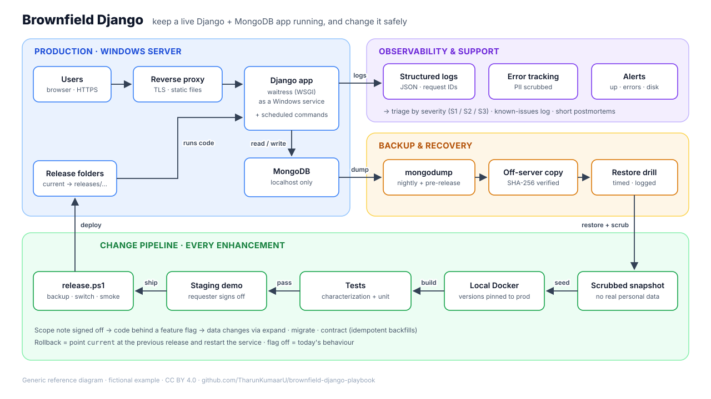

# Brownfield Django

**Taking over, supporting and safely enhancing a live Django + MongoDB app.**

Someone hands you the keys to an app that's already in production. The original developers have moved on. Real users log in every morning. The docs are thin, the database has no migrations, and the first feature request is already waiting.

This playbook is what I wish I'd had on day one. It's a practical, opinionated guide to the unglamorous part of software work: **keeping a system you didn't build running, and changing it without breaking it.**

  

> **Provenance & disclaimer**
> This is a personal project. It distills general lessons from my own experience supporting and enhancing production web applications. Everything here was written from scratch for this repository: every code sketch, diagram, schema and example is original and generic. "Acme Field Services" and all data, names and numbers are fictional. The repo contains no proprietary code, documents, designs or business rules from any employer or client. It is not affiliated with, sponsored by or endorsed by any employer or client, past or present.

---

## Contents

| # | Doc | What you get |
|---|-----|--------------|
| 01 | [The first 72 hours](docs/01-first-72-hours.md) | Onboard to a live system without becoming its next incident |
| 02 | [Mapping an unfamiliar Django codebase](docs/02-mapping-the-codebase.md) | Trace URLs → views → models, find the hidden jobs |
| 03 | [The Django + MongoDB data layer](docs/03-django-mongodb-data-layer.md) | Recover the implicit schema and measure drift |
| 04 | [A reproducible local & staging copy](docs/04-reproducible-environments.md) | Docker Compose plus a scrubbed data snapshot |
| 05 | [Safety nets before changes](docs/05-safety-nets.md) | Characterization tests and smoke checks |
| 06 | [From request to scoped change](docs/06-request-to-scoped-change.md) | Impact analysis, feature flags, sign-off |
| 07 | [Evolving a schema-less database](docs/07-evolving-schemaless-data.md) | Idempotent backfills and versioned documents |
| 08 | [Deploying to a Windows server](docs/08-windows-deployment.md) | Services, reverse proxy, release folders, one-step rollback |
| 09 | [Backups that actually restore](docs/09-backups-and-restore-drills.md) | `mongodump` strategy and restore drills |
| 10 | [Support triage & observability](docs/10-support-triage-observability.md) | Logs, error tracking, severity rules, known-issues log |
| 11 | [Case study: one enhancement, end to end](docs/11-case-study.md) | Docs 01–10 applied to one fictional feature |

Each doc ends with a **checklist** you can copy into a ticket. Most include a **failure-mode table**, because on a brownfield system the question is rarely "how do I build this?" It is usually "how will this break, and how will I know?"

## Principles

1. **Production is a guest, not a playground.** Read-only first. Every write gets a backup and a rollback plan.
2. **Write down what exists before changing what exists.** A one-page app guide beats a heroic memory.
3. **The code is the spec, but the data is the truth.** In a schema-less database, the real schema lives in the documents. Measure it.
4. **Lock in today's behaviour before improving it.** Characterization tests first, refactors second.
5. **Small, reversible changes beat big, clever ones.** Feature flags, idempotent scripts, release folders.
6. **A backup you haven't restored is a rumour.**
7. **Scope is a deliverable.** An enhancement is agreed in writing, including what it won't do.
8. **Make the next person's first day easier than yours was.** That person might be you in six months.

## Who this is for

- Developers who've just inherited a Django app, especially one on MongoDB rather than a relational database.
- Freelancers and small-team engineers who support client systems they didn't build.
- Anyone who has to say "yes, I can change that safely" and mean it.

## How this was written

I wrote the structure, the opinions and the checklists from my own support and enhancement work. I used an AI assistant (Claude) to help draft prose, tidy code sketches and produce the diagrams, then reviewed and edited everything. The code sketches are illustrative: they are meant to show a pattern clearly, not to be dropped into production untested.

## Roadmap

- [ ] Runnable sample repo for "Acme Field Services" with the tests from doc 05
- [ ] Linux/containerised variant of doc 08
- [ ] Performance doc: slow queries, indexes and the MongoDB profiler
- [ ] Security hardening checklist for inherited apps (secrets, dependencies, admin exposure)
- [ ] Printable one-page "first week" checklist

Suggestions and corrections are welcome as issues.

## License

This repository is dual-licensed. Copyright (c) 2026 Tharun Kumaar Udayakumar.

- **Documentation, prose and diagrams:** [CC BY 4.0](https://creativecommons.org/licenses/by/4.0/)
- **Code sketches and snippets:** [MIT](https://opensource.org/licenses/MIT)

See [LICENSE.md](LICENSE.md) for details.
