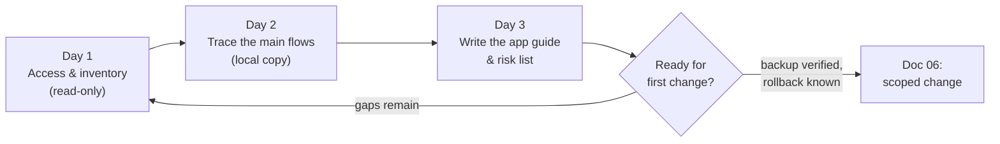

# 01 · The first 72 hours

> Goal: understand the system well enough to keep it alive, **without changing anything yet**.

When you inherit a live app, the riskiest moment is the start. You have access but not context, and there's pressure to "just fix one small thing". Spend the first three days building a map instead.

## The running example

Throughout this playbook we use **Acme Field Services**, a fictional Django + MongoDB app that dispatches technicians to jobs:

- Office staff create **work orders**, assign **technicians** and track **approvals**.
- Technicians update job status from a mobile-friendly web page.
- A nightly job emails a summary to managers.
- It runs on a single Windows server, with MongoDB on the same box.

## Day-by-day plan



### Day 1: access and inventory (read-only)

Ask for **read-only** access first, even if you'll get admin later. Then write down what's actually running:

| Question | Where to look |
|----------|---------------|
| What processes serve the app? | Windows Services, Task Manager, `sc query`, NSSM configs |
| Which Python & Django versions? | `python --version`, `pip freeze`, `django.get_version()` |
| Where is the code deployed from? | Folder on disk vs. git repo. Is there a repo at all? |
| Where are settings and secrets? | `settings.py`, `.env`, environment variables, service config |
| Which database, which version? | `mongosh --eval "db.version()"`, connection string in settings |
| What runs on a schedule? | Task Scheduler, cron-style management commands, Celery beat |
| Who uses it and when? | Web server logs by hour, user list, "who complains when it's down?" |
| Is there a backup? When was it last restored? | Backup folder dates, scheduled tasks, ask directly |

A small script saves the inventory as a file you can diff later:

```python
# inventory.py: run on the server with the app's virtualenv active
import json, platform, subprocess, sys
from datetime import datetime, timezone

def sh(cmd: list[str]) -> str:
    try:
        return subprocess.run(cmd, capture_output=True, text=True, timeout=20).stdout.strip()
    except Exception as exc:  # inventory must never crash
        return f"ERROR: {exc}"

report = {
    "captured_at": datetime.now(timezone.utc).isoformat(),
    "host_os": platform.platform(),
    "python": sys.version,
    "pip_freeze": sh([sys.executable, "-m", "pip", "freeze"]).splitlines(),
    "services": sh(["sc", "query", "type=", "service", "state=", "all"])[:20000],
    "scheduled_tasks": sh(["schtasks", "/query", "/fo", "LIST"])[:20000],
}
with open("inventory.json", "w", encoding="utf-8") as fh:
    json.dump(report, fh, indent=2)
print("wrote inventory.json")
```

> Keep `inventory.json` in a private place. It describes a real server and must never go into a public repo.

### Day 2: trace the main flows (on a local copy)

Get the code running locally (see [doc 04](04-reproducible-environments.md)) and trace the two or three flows users rely on most. For Acme that's *create work order → assign → close*. Doc 02 shows how.

### Day 3: write the app guide and a risk list

Write a one-page **app guide** (template below) and a **risk list**. The risk list is what lets you say no to a risky change with evidence rather than nerves.

```markdown
# Acme Field Services: App Guide (v0.1)

## What it does (3 lines)
## How to reach it (URLs, who has access)
## Runtime (services, ports, folders, Python/Django/Mongo versions)
## Main flows (links to diagrams)
## Scheduled jobs (name, schedule, what it touches)
## Data (collections, rough sizes, who writes them)
## Backups (where, how often, last restore test)
## Known issues (link to known-issues log, doc 10)
## Contacts (roles, not names, in anything shared)
```

## Failure modes

| Failure | Early warning | Prevention |
|---------|---------------|------------|
| "Quick fix" on day 1 breaks production | Pressure to change before understanding | Read-only access first; no writes without backup + rollback |
| Assumed a backup exists; it doesn't | Nobody can say when it last ran | Verify the backup file and its date on day 1 |
| A scheduled job you didn't know about fails after a change | Unexplained emails or data changes overnight | Inventory Task Scheduler and management commands |
| Secrets end up in your notes or chat | Copying settings files around | Record *where* secrets live, never their values |
| Knowledge stays in your head | You're the only one who can answer questions | App guide v0.1 by day 3, stored with the code |

## Checklist

- [ ] Read-only access to server, database and code
- [ ] Inventory captured (processes, versions, settings location, scheduled jobs)
- [ ] Latest backup located and its timestamp confirmed
- [ ] Code runs locally
- [ ] Top 2–3 user flows traced
- [ ] App guide v0.1 written
- [ ] Risk list shared with whoever assigns the work
