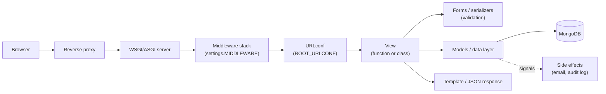
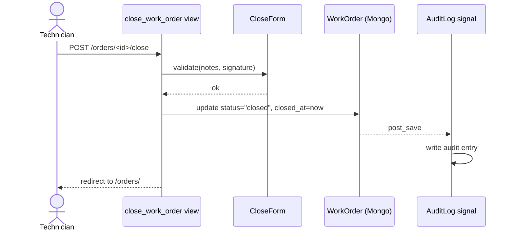

# 02 · Mapping an unfamiliar Django codebase

> Goal: answer "if a user clicks X, which code runs and which data changes?" for any screen.

Django projects follow conventions, and conventions are a map. Start from the edges (URLs, commands, signals) and work inwards.

## The request path

The [application architecture diagram](../assets/app-architecture.svg) shows the full picture for the example app. The simplified path below is what to trace first.



Every arrow is a place where behaviour can hide. Middleware and signals are the classic surprises.

## Step 1: list every URL

Django already knows every route. Ask it:

```python
# myproject/management/commands/list_routes.py
from django.core.management.base import BaseCommand
from django.urls import get_resolver, URLPattern, URLResolver

def walk(patterns, prefix=""):
    for p in patterns:
        if isinstance(p, URLResolver):
            yield from walk(p.url_patterns, prefix + str(p.pattern))
        elif isinstance(p, URLPattern):
            cb = p.callback
            name = getattr(cb, "view_class", cb)
            yield prefix + str(p.pattern), f"{name.__module__}.{name.__qualname__}", p.name

class Command(BaseCommand):
    help = "Print every URL pattern with the view that handles it."

    def handle(self, *args, **opts):
        for route, view, name in sorted(walk(get_resolver().url_patterns)):
            self.stdout.write(f"{route:<50} {view:<60} {name or ''}")
```

(`django-extensions` offers `show_urls` if you're allowed to add a dev dependency.)

Paste the output into a spreadsheet and add two columns: **"Who uses this?"** and **"Writes data?"**. That table is the backbone of your impact analysis in [doc 06](06-request-to-scoped-change.md).

## Step 2: find the code that runs without a request

| Hiding place | How to find it |
|--------------|----------------|
| Management commands | `*/management/commands/*.py` |
| Scheduled tasks | Windows Task Scheduler, cron, Celery beat schedule in settings |
| Signals | `grep -rn "post_save\|pre_save\|@receiver" --include=*.py` |
| Middleware | `settings.MIDDLEWARE`, especially custom ones |
| Context processors | `TEMPLATES[...]["OPTIONS"]["context_processors"]` |
| `AppConfig.ready()` | Runs at startup, often registers signals or monkey-patches |
| Template tags | `*/templatetags/*.py`; sometimes these query the DB |

## Step 3: understand settings layering

Inherited projects often have several settings files and environment overrides. Print the **effective** values that matter:

```python
# python manage.py shell
from django.conf import settings
for key in ["DEBUG", "ALLOWED_HOSTS", "DATABASES", "INSTALLED_APPS",
            "MIDDLEWARE", "TIME_ZONE", "USE_TZ", "EMAIL_BACKEND", "STATIC_ROOT"]:
    val = getattr(settings, key, "<unset>")
    if key == "DATABASES":
        val = {k: {kk: ("***" if "PASS" in kk.upper() or kk == "HOST" else vv)
                   for kk, vv in v.items()} for k, v in val.items()}
    print(f"{key:15} = {val}")
```

Check which settings module is actually used: `DJANGO_SETTINGS_MODULE` in the service config can differ from what `manage.py` defaults to.

## Step 4: trace one flow end to end

Pick a real flow ("close a work order") and write it as a sequence diagram. Keep it in the repo next to the code.



## Reading tips

- **Search for strings users see.** The label on a button leads you to its template, then its URL, then its view.
- **Use the debugger, not just print.** `breakpoint()` in a local copy while clicking through the UI beats hours of reading.
- **Read tests first, if any exist.** They're the closest thing to a spec.
- **Note dead code, but don't delete it yet.** Something might call it via a scheduled task.

## Failure modes

| Failure | Cause | Prevention |
|---------|-------|------------|
| A change breaks an unrelated screen | Shared template tag or context processor | Search for usages of anything you touch |
| Data changes "by itself" | Signal handler or scheduled command | Inventory signals and commands (Step 2) |
| Works locally, fails on server | Different settings module in service config | Print effective settings on both |
| Deleted "unused" code breaks nightly job | Called only from a management command | Grep commands and scheduler before deleting |

## Checklist

- [ ] Route table generated and annotated (users, writes data?)
- [ ] Management commands, signals, middleware and scheduled jobs listed
- [ ] Effective settings compared: local vs. server
- [ ] Top flows drawn as sequence diagrams and stored with the code
