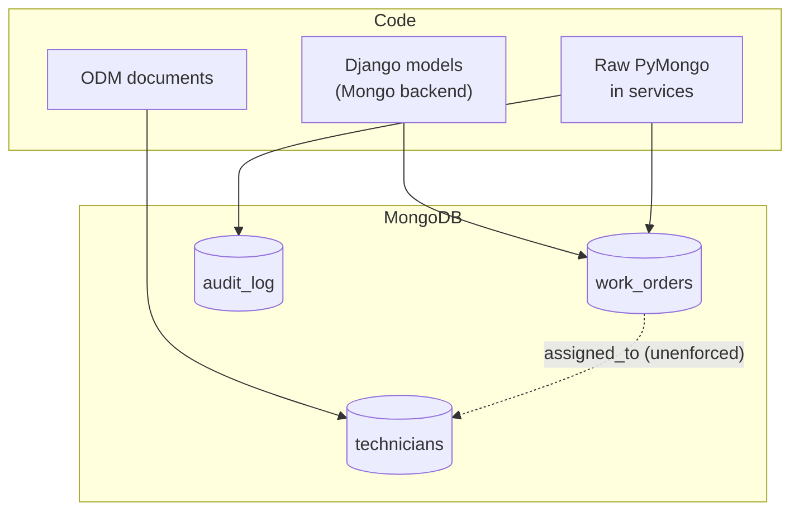

# 03 · The Django + MongoDB data layer

> Goal: know exactly how the app talks to MongoDB, and what the data *really* looks like.

Django was built for relational databases. When a Django app uses MongoDB, someone made a choice about how to bridge the two, and that choice shapes everything you can safely do.

## Step 1: identify the integration style

| Style | How to spot it | What it means for you |
|-------|----------------|-----------------------|
| **Django ORM via a Mongo backend** (e.g. Djongo, or the official Django MongoDB backend) | `DATABASES["default"]["ENGINE"]` points at a Mongo backend; models subclass `django.db.models.Model` | ORM feels normal, but some queries translate poorly. Check the backend's supported features and versions carefully before upgrading Django |
| **ODM (e.g. MongoEngine)** | Models subclass `mongoengine.Document`; `connect(...)` somewhere at startup | No Django migrations, no Django admin for those models; validation lives in the ODM |
| **Raw PyMongo** | `MongoClient(...)`, `db["collection"].find(...)` in views or services | No schema in code at all; the documents *are* the schema |
| **Mixed** | Several of the above | Very common in inherited apps. Map which collections go through which path |

```python
# Quick probe: where does MongoDB get touched?
# grep -rnE "MongoClient|mongoengine|djongo|django_mongodb|pymongo" --include=*.py .
```

## Step 2: recover the implicit schema

Even with an ODM, old documents may not match today's model. Sample the real data and measure it:

```python
# schema_probe.py: read-only; run against a staging copy, not production
from collections import Counter, defaultdict
from pymongo import MongoClient

def type_name(v):
    return type(v).__name__

def probe(coll, sample_size=2000):
    fields: dict[str, Counter] = defaultdict(Counter)
    total = 0
    for doc in coll.aggregate([{"$sample": {"size": sample_size}}]):
        total += 1
        stack = [("", doc)]
        while stack:
            prefix, obj = stack.pop()
            for k, v in obj.items():
                path = f"{prefix}{k}"
                fields[path][type_name(v)] += 1
                if isinstance(v, dict):
                    stack.append((path + ".", v))
    print(f"\n== {coll.name} (sampled {total})")
    for path, types in sorted(fields.items()):
        present = sum(types.values())
        flag = "  <-- mixed types" if len(types) > 1 else ""
        print(f"{path:40} {present/total:6.1%}  {dict(types)}{flag}")

db = MongoClient("mongodb://localhost:27017")["acme_staging"]
for name in db.list_collection_names():
    probe(db[name])
```

Typical output tells a story:

```
== work_orders (sampled 2000)
_id                                      100.0%  {'ObjectId': 2000}
status                                   100.0%  {'str': 2000}
priority                                  71.4%  {'int': 1102, 'str': 326}  <-- mixed types
assigned_to                               93.0%  {'ObjectId': 1860}
closed_at                                 38.2%  {'datetime': 701, 'str': 63}  <-- mixed types
```

`priority` is sometimes a string: an older form must have saved `"2"` instead of `2`. `closed_at` is sometimes a string: dates imported from a spreadsheet. **These are the bugs waiting to happen.** Record them in the app guide.

## Step 3: check indexes against real queries

```javascript
// mongosh
db.work_orders.getIndexes()
db.setProfilingLevel(1, { slowms: 100 })   // staging only
// ...click through the slow screens...
db.system.profile.find().sort({ millis: -1 }).limit(10)
```

A query that filters on `assigned_to` and sorts by `created_at` wants a compound index `{assigned_to: 1, created_at: -1}`. Add indexes in a planned change (doc 07), never ad hoc on production during business hours.

## Step 4: know the relationships the database doesn't enforce

MongoDB won't stop a work order from pointing at a deleted technician. Find the references and check them:

```python
missing = db.work_orders.aggregate([
    {"$lookup": {"from": "technicians", "localField": "assigned_to",
                 "foreignField": "_id", "as": "t"}},
    {"$match": {"assigned_to": {"$ne": None}, "t": {"$size": 0}}},
    {"$count": "orphans"},
])
print(list(missing))
```

## Data-layer map



Two code paths writing `work_orders` is a red flag: validation in one path won't protect the other.

## Failure modes

| Failure | Symptom | Prevention |
|---------|---------|------------|
| Mixed field types | `TypeError` comparing `str` and `int`; wrong sort order | Schema probe; normalise with a backfill (doc 07) |
| Orphaned references | "NoneType has no attribute…" on detail pages | Orphan check; defensive lookups |
| Missing index | Page slows as data grows | Profile real queries; planned index changes |
| Two write paths, one validates | Bad data despite "validation" | Route writes through one service function |
| Django upgrade breaks Mongo backend | App won't start after `pip install -U` | Pin versions; check backend compatibility first |

## Checklist

- [ ] Integration style(s) identified per collection
- [ ] Schema probe run; mixed types and optional fields recorded
- [ ] Indexes listed and compared with slow queries
- [ ] Unenforced references checked for orphans
- [ ] Data-layer map added to the app guide
