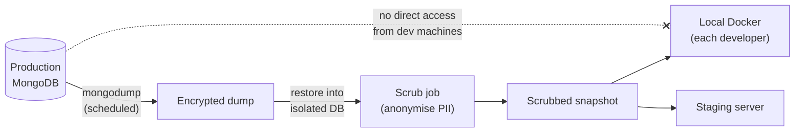

# 04 · A reproducible local & staging copy

> Goal: a copy of the app you can break freely, with data realistic enough to find real bugs but scrubbed of anything personal.

If you can't reproduce a bug off production, you'll end up debugging on production. This doc prevents that.

## The shape



The dotted line is the rule: developer machines never connect to the production database.

## Docker Compose for local development

Pin versions to match production. Mismatched MongoDB versions cause subtle query differences.

```yaml
# compose.yaml
services:
  mongo:
    image: mongo:7.0            # match production's major version
    ports: ["27017:27017"]
    volumes:
      - mongo-data:/data/db
      - ./snapshots:/snapshots:ro
    healthcheck:
      test: ["CMD", "mongosh", "--quiet", "--eval", "db.adminCommand('ping')"]
      interval: 5s
      retries: 10

  web:
    build: .
    command: python manage.py runserver 0.0.0.0:8000
    env_file: .env.local        # never the production .env
    environment:
      DJANGO_SETTINGS_MODULE: acme.settings.local
      MONGO_URI: mongodb://mongo:27017/acme_local
    ports: ["8000:8000"]
    volumes: [".:/app"]
    depends_on:
      mongo: { condition: service_healthy }

volumes:
  mongo-data:
```

```dockerfile
# Dockerfile: match production's Python version exactly
FROM python:3.12-slim
WORKDIR /app
COPY requirements.txt .
RUN pip install --no-cache-dir -r requirements.txt
COPY . .
```

If the project has no `requirements.txt`, generate one from the server's `pip freeze` (doc 01 inventory) and commit it. That's often the single most valuable file you add in week one.

## Scrubbing data

Scrub **before** the snapshot leaves the restricted environment. Replace personal data consistently, so relationships still work and the same input always maps to the same fake output.

```python
# scrub.py: runs against a *restored copy*, never production
import hashlib
from pymongo import MongoClient

SALT = "rotate-me-per-snapshot"     # keep out of source control in real use

def fake(value: str, kind: str) -> str:
    h = hashlib.sha256(f"{SALT}:{kind}:{value}".encode()).hexdigest()[:8]
    return {
        "name":  f"Person {h}",
        "email": f"user-{h}@example.test",
        "phone": f"+000-{int(h, 16) % 10_000_000:07d}",
    }[kind]

RULES = {
    "technicians": {"name": "name", "email": "email", "phone": "phone"},
    "customers":   {"contact_name": "name", "contact_email": "email"},
}

db = MongoClient("mongodb://localhost:27017")["acme_restore"]
for coll, fields in RULES.items():
    for doc in db[coll].find({}, {f: 1 for f in fields}):
        update = {f: fake(str(doc[f]), kind) for f, kind in fields.items() if doc.get(f)}
        if update:
            db[coll].update_one({"_id": doc["_id"]}, {"$set": update})
    print(f"scrubbed {coll}")

# Free-text fields can hide personal data: blank them rather than guess.
db.work_orders.update_many({}, {"$set": {"internal_notes": "[scrubbed]"}})
```

Then prove it worked:

```python
leaks = db.technicians.count_documents({"email": {"$not": {"$regex": r"@example\.test$"}}})
assert leaks == 0, f"{leaks} unscrubbed emails"
```

## Staging

Staging should match production in **shape** (same OS family, service manager, Python, MongoDB major version), not in size. Its job is to catch "works on my machine" before users do.

| | Local | Staging | Production |
|--|-------|---------|------------|
| Data | Scrubbed snapshot | Scrubbed snapshot | Real |
| Settings module | `settings.local` | `settings.staging` | `settings.production` |
| `DEBUG` | True | False | False |
| Outbound email | Console backend | Captured (e.g. a mail sink) | Real SMTP |
| Who deploys | You | Release script | Release script |

Outbound email on staging is a classic trap: a restored snapshot plus a real SMTP backend can mail real customers. Always capture it.

## Failure modes

| Failure | Consequence | Prevention |
|---------|-------------|------------|
| Staging sends real emails | Customers get test messages | Capture backend on staging; scrubbed addresses |
| Version drift (Python/Mongo) | Bug appears only in production | Pin images to production versions |
| Snapshot contains PII | Privacy incident on a laptop | Scrub inside restricted environment; automated leak check |
| No `requirements.txt` | Can't rebuild the environment | Generate from server `pip freeze` and commit |
| Developer connects to prod DB "just to check" | Accidental writes | Network rules; no prod credentials on dev machines |

## Checklist

- [ ] Compose file with versions pinned to production
- [ ] `requirements.txt` committed
- [ ] Scrub script with automated leak assertions
- [ ] Staging email captured, not sent
- [ ] Documented refresh process for snapshots
