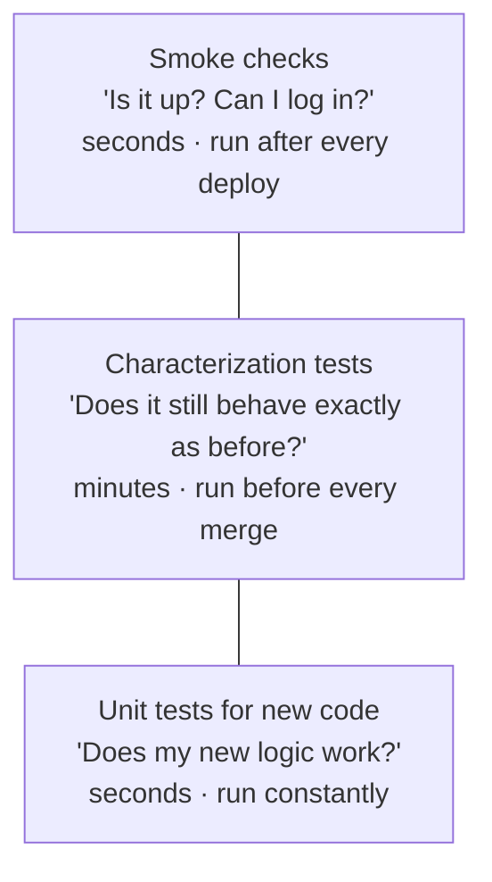

# 05 · Safety nets before changes

> Goal: find out *immediately* if a change breaks something that used to work.

Inherited apps rarely have tests. You don't need full coverage before your first change. You need tests around **the code you're about to touch** and a smoke check for **the flows users can't live without**.

## Three layers, cheapest first



## Characterization tests: lock in today's behaviour

A characterization test doesn't check what the code *should* do. It records what the code *does* today, even if that's odd. When you later change behaviour on purpose, the test tells you, and you update it deliberately.

```python
# tests/test_work_order_listing_characterization.py
import json
from pathlib import Path
import pytest

GOLDEN = Path(__file__).parent / "golden" / "work_order_list.json"

@pytest.mark.django_db
def test_work_order_list_matches_golden(client, seeded_db, django_user_model):
    user = django_user_model.objects.create_user("dispatcher", password="x")
    client.force_login(user)

    resp = client.get("/orders/?status=open", HTTP_ACCEPT="application/json")
    assert resp.status_code == 200
    actual = normalise(resp.json())

    if not GOLDEN.exists():                      # first run records the baseline
        GOLDEN.parent.mkdir(exist_ok=True)
        GOLDEN.write_text(json.dumps(actual, indent=2, sort_keys=True))
        pytest.skip("golden file recorded; review and commit it")

    assert actual == json.loads(GOLDEN.read_text())

def normalise(payload):
    """Strip fields that legitimately change between runs."""
    for row in payload["results"]:
        row.pop("id", None)
        row.pop("updated_at", None)
    return payload
```

For HTML views, compare the parts that matter (row count, key cells) rather than the whole page, or the test breaks on every whitespace change.

## Seed data you control

Tests need a known database state. A small fixture factory beats a copied snapshot:

```python
# tests/conftest.py
import pytest
from datetime import datetime, timezone
from pymongo import MongoClient

@pytest.fixture
def seeded_db(settings):
    db = MongoClient(settings.MONGO_URI)[settings.MONGO_TEST_DB]
    db.work_orders.delete_many({})
    db.technicians.delete_many({})
    tech_id = db.technicians.insert_one({"name": "Test Tech", "active": True}).inserted_id
    db.work_orders.insert_many([
        {"ref": "WO-1", "status": "open",   "priority": 1,   "assigned_to": tech_id,
         "created_at": datetime(2026, 1, 5, tzinfo=timezone.utc)},
        {"ref": "WO-2", "status": "open",   "priority": "2", "assigned_to": None,   # legacy string
         "created_at": datetime(2026, 1, 6, tzinfo=timezone.utc)},
        {"ref": "WO-3", "status": "closed", "priority": 3,   "assigned_to": tech_id,
         "created_at": datetime(2026, 1, 7, tzinfo=timezone.utc)},
    ])
    yield db
```

Notice `WO-2`: seed data should include **the messy cases from your schema probe** (doc 03). That's where regressions hide.

## Smoke checks: a script anyone can run

```python
# smoke.py: usage: python smoke.py https://staging.acme.example
import sys, requests

BASE = sys.argv[1].rstrip("/")
CHECKS = [
    ("health endpoint", "GET", "/healthz", 200),
    ("login page",      "GET", "/accounts/login/", 200),
    ("static files",    "GET", "/static/css/app.css", 200),
    ("auth required",   "GET", "/orders/", 302),
]

failed = 0
for label, method, path, expected in CHECKS:
    try:
        r = requests.request(method, BASE + path, allow_redirects=False, timeout=10)
        ok = r.status_code == expected
    except requests.RequestException as exc:
        ok, r = False, exc
    failed += not ok
    print(f"{'PASS' if ok else 'FAIL'}  {label:<16} {getattr(r, 'status_code', r)}")
sys.exit(1 if failed else 0)
```

If the app has no `/healthz`, adding one is a great first low-risk change:

```python
# acme/health.py
from django.http import JsonResponse
from pymongo import MongoClient
from django.conf import settings

def healthz(request):
    try:
        MongoClient(settings.MONGO_URI, serverSelectionTimeoutMS=1000).admin.command("ping")
        return JsonResponse({"status": "ok"})
    except Exception:
        return JsonResponse({"status": "db_unreachable"}, status=503)
```

## Failure modes

| Failure | Why it happens | Prevention |
|---------|----------------|------------|
| Tests pass, production breaks | Seed data too clean | Seed the messy cases from the schema probe |
| Golden files updated blindly | "Just regenerate it" habit | Review golden diffs in the PR like code |
| Flaky tests get ignored | Time or ordering dependencies | Freeze time; sort outputs; fix or delete flaky tests |
| Tests hit the real database | Wrong settings in test run | Separate test DB name; assert it in `conftest.py` |
| Smoke check never run | Manual and forgotten | Make it the last step of the release script (doc 08) |

## Checklist

- [ ] Test runner works locally (`pytest` + `pytest-django`)
- [ ] Seed fixtures include known legacy data shapes
- [ ] Characterization tests around every area the next change touches
- [ ] `/healthz` endpoint exists
- [ ] Smoke script runs against staging and production
