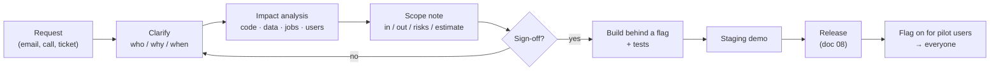

# 06 · From enhancement request to scoped change

> Goal: turn "can you just add…" into a change that is agreed, sized, reversible and shipped.

On a live system, most trouble starts before any code is written: a vague request, an unspoken assumption, a "small" change that touches five screens. This doc is the bridge between the conversation and the commit.

## The flow



## Step 1: clarify

Five questions resolve most ambiguity:

1. **Who** will use this, and how often?
2. **What problem** does it solve? (Not "what should we build?")
3. **What happens today** without it? That's your fallback if it's late.
4. **How will we know it works?** One observable outcome.
5. **When** is it needed, and what's driving the date?

## Step 2: impact analysis

Use the route table (doc 02) and data-layer map (doc 03) to answer, in writing:

| Area | Question | Example answer (fictional) |
|------|----------|---------------------------|
| Screens | Which views and templates change? | Work order detail, work order list |
| Data | New fields? Changed meaning of old ones? Backfill needed? | New `approval` sub-document; backfill `approval.state="not_required"` |
| Jobs | Does any scheduled job read this data? | Nightly summary email counts open orders |
| Integrations | Exports, reports, APIs that consumers depend on? | CSV export used by finance |
| Permissions | Who can see or do the new thing? | Managers approve; technicians view only |
| Rollback | Can we turn it off without data loss? | Yes, via flag; the new field is ignored when off |

## Step 3: the scope note

Keep it to one page. Get a written "yes" on it.

```markdown
## Change: Manager approval for high-priority work orders

**Problem:** High-priority jobs are sometimes dispatched without a manager's review.
**In scope:**
- "Request approval" button on priority-1 orders
- Manager sees pending approvals on a new list page
- Order cannot move to "dispatched" until approved
**Out of scope:** email notifications (phase 2), mobile push, approval history report
**Data:** new `approval` sub-document; one-time backfill for existing orders
**Risks:** nightly summary must count "awaiting approval" correctly
**Rollback:** feature flag `approvals_v1`; off = current behaviour
**Estimate:** 4–6 days incl. tests and staging demo
**Acceptance:** a manager approves an order on staging; a technician cannot dispatch it before
```

"Out of scope" is the most useful line on the page. It stops the change quietly doubling in size.

## Step 4: build behind a feature flag

A flag lets you deploy code without releasing behaviour, and turn it off without a redeploy.

```python
# acme/flags.py: tiny flag helper backed by a Mongo collection
from functools import lru_cache
from django.conf import settings
from pymongo import MongoClient

_db = MongoClient(settings.MONGO_URI)[settings.MONGO_DB]

def is_enabled(flag: str, user=None) -> bool:
    doc = _db.feature_flags.find_one({"_id": flag}) or {}
    if doc.get("enabled_for_all"):
        return True
    if user is not None and user.is_authenticated:
        return user.username in doc.get("pilot_users", [])
    return False
```

```python
# in the view
from acme.flags import is_enabled

def dispatch_order(request, order_id):
    order = orders.get(order_id)
    if is_enabled("approvals_v1", request.user) and order["priority"] == 1:
        if order.get("approval", {}).get("state") != "approved":
            return render(request, "orders/needs_approval.html", {"order": order}, status=409)
    orders.mark_dispatched(order_id, by=request.user)
    return redirect("orders:detail", order_id)
```

(For bigger projects, a library such as `django-waffle` gives you this with an admin UI.)

Rules for flags on a brownfield app:

- **The "off" path must be today's behaviour, unchanged.** Characterization tests prove it.
- **Test both paths.** Parametrise tests over flag on/off.
- **Remove the flag** within a few weeks of full rollout. Old flags are tech debt.

## Failure modes

| Failure | Symptom | Prevention |
|---------|---------|------------|
| Scope creep | "While you're in there…" | Written out-of-scope list; phase 2 backlog |
| Hidden consumer breaks | Finance export wrong after release | Impact table includes jobs & exports |
| No way back | Bug found after release; rollback needs a data fix | Flag + backward-compatible data change |
| Flag leaks into forever | Code full of dead branches | Removal date in the scope note |
| Acceptance disputed | "That's not what I asked for" | One observable acceptance test, agreed up front |

## Checklist

- [ ] Five clarifying questions answered
- [ ] Impact table filled (screens, data, jobs, integrations, permissions, rollback)
- [ ] Scope note signed off, including out-of-scope list
- [ ] Code behind a flag; both paths tested
- [ ] Staging demo done with the requester
- [ ] Flag removal date set
