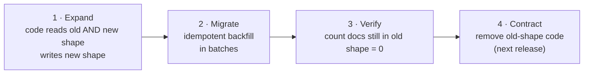

# 07 · Evolving a schema-less database

> Goal: change the shape of live data safely, when there are no Django migrations to do it for you.

"Schema-less" doesn't mean there's no schema. It means the schema lives in the code and in the documents, and nothing keeps them in sync except you.

## The expand → migrate → contract pattern

Never change code and data in one leap. Go through a state where **old and new shapes both work**.



Every step is independently deployable and reversible. If step 2 fails halfway, the app still works, because step 1 handles both shapes.

## Step 1: expand (read both shapes)

Example: `priority` was sometimes stored as a string. We want it to always be an int.

```python
# acme/orders/normalise.py
def read_priority(doc) -> int | None:
    """Accept legacy string values; always return an int (or None)."""
    raw = doc.get("priority")
    if raw is None or raw == "":
        return None
    try:
        return int(raw)
    except (TypeError, ValueError):
        return None   # unknown legacy value: log it (doc 10), don't crash the page
```

All reads go through `read_priority`. All new writes store an `int`.

## Step 2: migrate with an idempotent, batched backfill

Idempotent means running it twice does no harm. That's essential: scripts get interrupted.

```python
# migrations_data/2026_03_priority_to_int.py
"""
Convert string priorities to ints.
Safe to re-run: only touches documents still holding a string.
Usage: python -m migrations_data.2026_03_priority_to_int --dry-run
"""
import argparse, time
from pymongo import MongoClient, UpdateOne

BATCH = 500

def main(uri: str, db_name: str, dry_run: bool):
    coll = MongoClient(uri)[db_name].work_orders
    query = {"priority": {"$type": "string"}}
    total = coll.count_documents(query)
    print(f"{total} documents to convert (dry_run={dry_run})")

    done, skipped = 0, 0
    while True:
        batch = list(coll.find(query, {"priority": 1}).limit(BATCH))
        if not batch:
            break
        ops = []
        for doc in batch:
            try:
                ops.append(UpdateOne({"_id": doc["_id"], "priority": doc["priority"]},
                                     {"$set": {"priority": int(doc["priority"])}}))
            except ValueError:
                # unconvertible: park it for a human instead of looping forever
                ops.append(UpdateOne({"_id": doc["_id"]},
                                     {"$set": {"priority": None,
                                               "priority_legacy": doc["priority"]}}))
                skipped += 1
        if dry_run:
            print(f"would update {len(ops)} docs, e.g. {batch[0]}")
            break
        coll.bulk_write(ops, ordered=False)
        done += len(ops)
        print(f"{done}/{total}")
        time.sleep(0.2)   # be gentle with a live database

    print(f"finished: {done} updated, {skipped} parked in priority_legacy")

if __name__ == "__main__":
    p = argparse.ArgumentParser()
    p.add_argument("--uri", default="mongodb://localhost:27017")
    p.add_argument("--db", default="acme_staging")
    p.add_argument("--dry-run", action="store_true")
    a = p.parse_args()
    main(a.uri, a.db, a.dry_run)
```

Key details:

- The filter (`$type: "string"`) makes it **idempotent** and **resumable**.
- Matching on the old value in `UpdateOne` avoids overwriting a concurrent edit.
- Unconvertible values are **parked**, not dropped, so nothing is lost.
- `--dry-run` first, on staging first, with a fresh backup (doc 09) before production.

Keep these scripts in the repo (`migrations_data/`) with a date prefix. They're the migration history the database doesn't keep.

## Step 3: verify

```javascript
db.work_orders.countDocuments({ priority: { $type: "string" } })   // expect 0
db.work_orders.countDocuments({ priority_legacy: { $exists: true } }) // review these by hand
```

## Step 4: contract

In the *next* release, simplify `read_priority` and optionally add a validator so the old shape can't return:

```javascript
db.runCommand({
  collMod: "work_orders",
  validator: { $jsonSchema: {
    bsonType: "object",
    properties: { priority: { bsonType: ["int", "null"] } }
  }},
  validationLevel: "moderate",    // existing invalid docs are not blocked on update
  validationAction: "warn"        // start with warn; switch to "error" once logs are quiet
})
```

## Versioned documents (for bigger changes)

For large reshapes, add a `schema_version` field and upgrade documents lazily on read, plus a background backfill:

```python
UPGRADERS = {
    1: lambda d: {**d, "approval": {"state": "not_required"}, "schema_version": 2},
}

def upgrade(doc):
    while (v := doc.get("schema_version", 1)) in UPGRADERS:
        doc = UPGRADERS[v](doc)
    return doc
```

## Failure modes

| Failure | Consequence | Prevention |
|---------|-------------|------------|
| Backfill interrupted halfway | Mixed shapes | Expand step first; idempotent filter; just re-run |
| Backfill overwrites a user's edit | Lost data | Match on old value in the update filter |
| Bad values silently dropped | Data loss nobody notices | Park in a `*_legacy` field and report counts |
| Long backfill slows the app | User-facing latency | Batches + sleep; run off-peak |
| Index built on a busy collection | Stalls during business hours | Build off-peak; check index build behaviour for your MongoDB version |
| Nobody knows what ran | Can't reason about data history | Dated scripts in `migrations_data/`, logged runs |

## Checklist

- [ ] Code reads both old and new shapes (expand)
- [ ] Backfill is idempotent, batched and has `--dry-run`
- [ ] Fresh backup taken and restore-tested (doc 09)
- [ ] Run on staging, then production off-peak
- [ ] Verification query returns 0 old-shape docs
- [ ] Contract step scheduled for the next release
