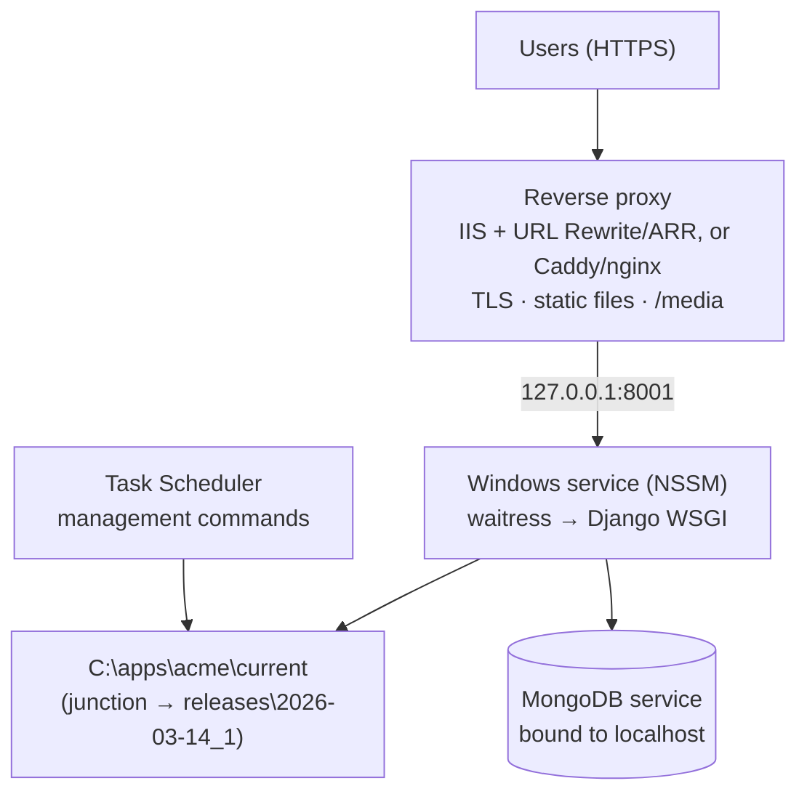

# 08 · Deploying to a Windows server

> Goal: releases that are boring, repeatable, and reversible in one command.

Plenty of Django apps run on Windows servers, often because that's what the organisation already runs. It's workable, but the usual Linux tutorials (gunicorn, systemd) don't apply. This doc is the Windows-shaped version.

## The layout



Key choices:

- **WSGI server: `waitress`.** Pure Python and runs well on Windows. (gunicorn doesn't run on Windows.)
- **Service manager: NSSM** (or a similar service wrapper). It restarts on crash, captures stdout/stderr to log files, and starts on boot.
- **Reverse proxy** terminates TLS and serves static files so Python doesn't have to.
- **MongoDB bound to `127.0.0.1`** and not exposed on the network.

## Folder structure with release folders

```
C:\apps\acme\
├── releases\
│   ├── 2026-03-07_1\      ← previous
│   └── 2026-03-14_1\      ← new
├── current  →  releases\2026-03-14_1   (directory junction)
├── shared\
│   ├── .env                (secrets, not in any release folder)
│   ├── media\
│   └── logs\
└── venvs\
    └── 2026-03-14_1\       (one virtualenv per release)
```

Rollback = point `current` back at the previous folder and restart the service. No reinstall, no git gymnastics.

## The service entry point

```python
# serve.py: started by the Windows service
import os
from waitress import serve
from acme.wsgi import application

serve(
    application,
    host="127.0.0.1",
    port=int(os.environ.get("ACME_PORT", "8001")),
    threads=int(os.environ.get("ACME_THREADS", "8")),
    url_scheme="https",          # proxy terminates TLS
    trusted_proxy="127.0.0.1",
    trusted_proxy_headers={"x-forwarded-for", "x-forwarded-proto"},
)
```

Register it once:

```powershell
nssm install AcmeWeb "C:\apps\acme\current\.venv-link\Scripts\python.exe" "C:\apps\acme\current\serve.py"
nssm set AcmeWeb AppDirectory "C:\apps\acme\current"
nssm set AcmeWeb AppEnvironmentExtra "DJANGO_SETTINGS_MODULE=acme.settings.production"
nssm set AcmeWeb AppStdout "C:\apps\acme\shared\logs\web.out.log"
nssm set AcmeWeb AppStderr "C:\apps\acme\shared\logs\web.err.log"
nssm set AcmeWeb AppRotateFiles 1
nssm set AcmeWeb AppRotateBytes 10485760
nssm set AcmeWeb Start SERVICE_AUTO_START
```

## The release script

```powershell
# release.ps1: usage: .\release.ps1 -Artifact C:\drops\acme-2026-03-14.zip
param([Parameter(Mandatory)] [string]$Artifact)
$ErrorActionPreference = "Stop"

$Root     = "C:\apps\acme"
$Stamp    = (Get-Date -Format "yyyy-MM-dd") + "_" + (Get-Random -Maximum 1000)
$Release  = "$Root\releases\$Stamp"
$Venv     = "$Root\venvs\$Stamp"
$Previous = (Get-Item "$Root\current").Target

Write-Host "1/7 unpack";         Expand-Archive $Artifact -DestinationPath $Release
Write-Host "2/7 venv";           py -3.11 -m venv $Venv
& "$Venv\Scripts\pip.exe" install --no-cache-dir -r "$Release\requirements.txt"
New-Item -ItemType Junction -Path "$Release\.venv-link" -Target $Venv | Out-Null
Copy-Item "$Root\shared\.env" "$Release\.env"

Write-Host "3/7 checks";         & "$Venv\Scripts\python.exe" "$Release\manage.py" check --deploy
Write-Host "4/7 static";         & "$Venv\Scripts\python.exe" "$Release\manage.py" collectstatic --noinput

Write-Host "5/7 backup";         & "$Root\scripts\backup.ps1" -Label "pre-$Stamp"   # doc 09

Write-Host "6/7 switch";
Remove-Item "$Root\current"      # removes the junction only, not its target
New-Item -ItemType Junction -Path "$Root\current" -Target $Release | Out-Null
Restart-Service AcmeWeb

Write-Host "7/7 smoke"
& "$Venv\Scripts\python.exe" "$Release\smoke.py" "https://acme.example"
if ($LASTEXITCODE -ne 0) {
    Write-Warning "smoke failed: rolling back to $Previous"
    Remove-Item "$Root\current"
    New-Item -ItemType Junction -Path "$Root\current" -Target $Previous | Out-Null
    Restart-Service AcmeWeb
    exit 1
}
Write-Host "released $Stamp"
```

And the one-step rollback, for when a problem shows up later:

```powershell
# rollback.ps1: points current at the previous release
$Root = "C:\apps\acme"
$releases = Get-ChildItem "$Root\releases" | Sort-Object Name -Descending
$target = $releases[1].FullName
Remove-Item "$Root\current"
New-Item -ItemType Junction -Path "$Root\current" -Target $target | Out-Null
Restart-Service AcmeWeb
Write-Host "rolled back to $target"
```

> Code rollback is only safe if the data change was backward compatible. That's why doc 07 insists on expand → migrate → contract.

## Scheduled management commands

Point Task Scheduler at the `current` junction so jobs always run the live release:

```powershell
$action  = New-ScheduledTaskAction -Execute "C:\apps\acme\current\.venv-link\Scripts\python.exe" `
           -Argument "manage.py send_daily_summary" -WorkingDirectory "C:\apps\acme\current"
$trigger = New-ScheduledTaskTrigger -Daily -At 6:30am
Register-ScheduledTask -TaskName "Acme-DailySummary" -Action $action -Trigger $trigger `
           -User "NT AUTHORITY\NETWORK SERVICE"
```

## Failure modes

| Failure | Symptom | Prevention |
|---------|---------|------------|
| Deploy overwrote working code in place | Can't get back to the last good state | Release folders + junction switch |
| Service didn't restart after reboot | Site down on Monday morning | `SERVICE_AUTO_START`; smoke check in monitoring (doc 10) |
| Static files 404 after release | Unstyled pages | `collectstatic` in script; proxy serves `/static` |
| Scheduled job runs old code | Job behaves like last month | Tasks point at `current`, not a release folder |
| Secrets inside release zip | Leaked with the artifact | `.env` only in `shared\`, copied at deploy |
| MongoDB exposed to network | Security incident | Bind to localhost; firewall rule |
| Log files fill the disk | Server stops writing | NSSM rotation; log retention job |

## Checklist

- [ ] Release folders + `current` junction in place
- [ ] Service wrapper configured: auto-start, log capture, rotation
- [ ] `release.ps1` runs checks, static, backup, switch, smoke, auto-rollback
- [ ] `rollback.ps1` tested on staging
- [ ] Scheduled tasks point at `current`
- [ ] MongoDB bound to localhost; secrets only in `shared\`
