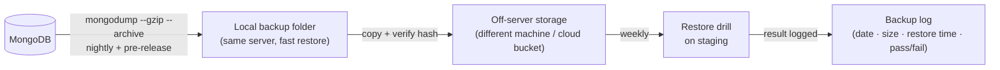

# 09 · Backups that actually restore

> Goal: be able to say, with evidence, "we can get back to any point in the last N days, and it takes about X minutes."

A backup you have never restored is a rumour. This doc turns it into a fact.

## Decide the numbers first

| Term | Question | Example for a small internal app |
|------|----------|----------------------------------|
| **RPO** (recovery point objective) | How much data can we afford to lose? | 24 hours, plus a snapshot before every release |
| **RTO** (recovery time objective) | How long can we be down? | 2 hours |
| **Retention** | How far back can we go? | 7 daily, 4 weekly, 3 monthly |

Write these in the app guide and get them agreed. They decide everything below. If the business needs RPO in minutes, nightly dumps aren't enough: you need a replica set with oplog-based point-in-time recovery.

## The 3-2-1 shape



**3** copies, on **2** different media, **1** off-site. A backup on the same disk as the database protects you from mistakes, not from losing the server.

## The backup script

```powershell
# backup.ps1: usage: .\backup.ps1 [-Label nightly]
param([string]$Label = "nightly")
$ErrorActionPreference = "Stop"

$Stamp   = Get-Date -Format "yyyyMMdd-HHmmss"
$Dir     = "D:\backups\acme"
$File    = "$Dir\acme-$Stamp-$Label.archive.gz"
New-Item -ItemType Directory -Force -Path $Dir | Out-Null

& mongodump --uri "mongodb://127.0.0.1:27017/acme" --gzip --archive="$File"
if ($LASTEXITCODE -ne 0) { throw "mongodump failed" }

$Hash = (Get-FileHash $File -Algorithm SHA256).Hash
"$Hash  $(Split-Path $File -Leaf)" | Out-File "$File.sha256" -Encoding ascii

# Off-server copy: replace with your storage tool of choice
Copy-Item $File, "$File.sha256" -Destination "\\backup-host\acme\"

# Retention: keep 14 local archives
Get-ChildItem $Dir -Filter "*.archive.gz" | Sort-Object Name -Descending |
    Select-Object -Skip 14 | ForEach-Object { Remove-Item $_.FullName, "$($_.FullName).sha256" }

Write-Host "backup ok: $File ($([math]::Round((Get-Item $File).Length/1MB,1)) MB)"
```

Notes:

- `mongodump` on a busy standalone server gives a snapshot that can be slightly inconsistent across collections. For small internal apps that's usually acceptable. For stricter needs, use a replica set and `--oplog`.
- Pre-release backups (called from `release.ps1`, doc 08) give you a clean restore point for every deploy.
- Encrypt archives that leave the server.

## The restore drill

Run it on a schedule, on staging, and time it.

```python
# restore_drill.py: restores the newest archive into a throwaway DB and checks it
import glob, hashlib, subprocess, time
from pymongo import MongoClient

archive = sorted(glob.glob(r"\\backup-host\acme\*.archive.gz"))[-1]

# 1. integrity
expected = open(archive + ".sha256").read().split()[0].lower()
actual = hashlib.sha256(open(archive, "rb").read()).hexdigest()
assert actual == expected, "checksum mismatch"

# 2. restore into a separate database name
t0 = time.time()
subprocess.run([
    "mongorestore", "--uri", "mongodb://127.0.0.1:27017", "--gzip",
    f"--archive={archive}", "--nsFrom=acme.*", "--nsTo=acme_drill.*", "--drop",
], check=True)
minutes = (time.time() - t0) / 60

# 3. sanity checks: does the data look like a real day?
db = MongoClient("mongodb://127.0.0.1:27017")["acme_drill"]
counts = {c: db[c].estimated_document_count() for c in ["work_orders", "technicians"]}
latest = db.work_orders.find_one(sort=[("created_at", -1)])["created_at"]
assert counts["work_orders"] > 0, "restored DB is empty"

print(f"PASS  archive={archive}  restore={minutes:.1f} min  counts={counts}  newest={latest}")
```

Log each result: date, archive, restore minutes, counts, pass/fail. After a few drills you have a measured RTO, not a guess.

## Failure modes

| Failure | How you find out | Prevention |
|---------|------------------|------------|
| Backup job silently stopped | During an incident | Monitor the newest archive's age (doc 10) |
| Archive corrupt | Restore fails | SHA-256 on write; verify on drill |
| Only copy on the same server | Server dies, backups die with it | Off-server copy |
| Restore takes far longer than expected | Missed RTO | Timed drills; measure, don't guess |
| Restored over production by mistake | Data loss | Restore into `*_drill` namespace; `--nsTo` |
| Backups contain PII in an unsafe place | Privacy incident | Encrypt; restrict access to backup storage |

## Checklist

- [ ] RPO, RTO and retention agreed and written down
- [ ] Nightly + pre-release backups with checksums
- [ ] Off-server copy
- [ ] Monthly (at least) restore drill, timed and logged
- [ ] Alert if newest backup is older than RPO
