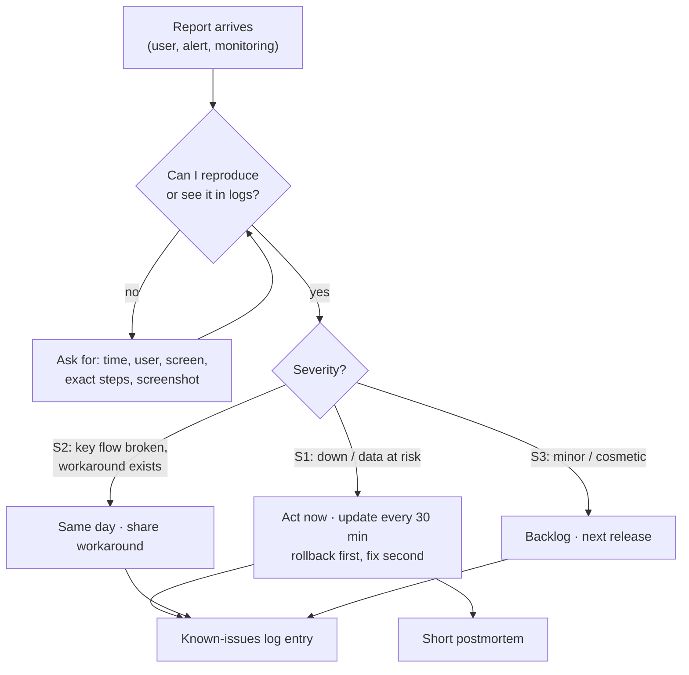

# 10 · Support triage & observability

> Goal: hear about problems before users do, and handle the ones users report calmly and consistently.

Supporting a live app is a steady stream of "it's not working". The difference between chaos and calm is having a triage rule, enough logs to answer questions, and a memory of what went wrong before.

## Triage flow



## Severity rules

Agree on these with the people who report issues, so "urgent" means the same thing to everyone.

| Level | Definition | Response | Example (fictional) |
|-------|------------|----------|---------------------|
| **S1** | App down, or data being lost or corrupted | Immediately; rollback considered first | Login fails for everyone |
| **S2** | A key flow broken, workaround exists | Same working day | Dispatch fails for one priority level |
| **S3** | Minor, cosmetic, or single user | Planned release | Column sorts in the wrong order |

## Structured logging

Logs you can search beat logs you have to read. Add a request ID and user to every line:

```python
# acme/logging_middleware.py
import logging, time, uuid
log = logging.getLogger("acme.request")

class RequestLogMiddleware:
    def __init__(self, get_response):
        self.get_response = get_response

    def __call__(self, request):
        request.request_id = request.headers.get("X-Request-ID", uuid.uuid4().hex[:12])
        start = time.monotonic()
        response = self.get_response(request)
        log.info("request", extra={
            "request_id": request.request_id,
            "user": getattr(request.user, "username", None),
            "method": request.method,
            "path": request.path,
            "status": response.status_code,
            "ms": round((time.monotonic() - start) * 1000),
        })
        response["X-Request-ID"] = request.request_id
        return response
```

```python
# settings/production.py (excerpt): JSON lines, rotated
LOGGING = {
    "version": 1,
    "formatters": {"json": {"()": "pythonjsonlogger.jsonlogger.JsonFormatter",
                            "fmt": "%(asctime)s %(levelname)s %(name)s %(message)s"}},
    "handlers": {"file": {"class": "logging.handlers.TimedRotatingFileHandler",
                          "filename": r"C:\apps\acme\shared\logs\app.jsonl",
                          "when": "midnight", "backupCount": 30, "formatter": "json"}},
    "root": {"handlers": ["file"], "level": "INFO"},
}
```

Show the request ID on the error page. When a user sends a screenshot, you can find the exact log lines.

## Error tracking

An error tracker (Sentry or a self-hosted equivalent) groups exceptions, shows the stack trace and counts how many users were hit. Configure it to **scrub personal data** before it leaves the server:

```python
import sentry_sdk
sentry_sdk.init(
    dsn=env("SENTRY_DSN"),
    environment="production",
    send_default_pii=False,
    traces_sample_rate=0.05,
)
```

## The four signals worth alerting on

For a small app, start here. Every alert must be something a human should act on.

| Signal | Check | Alert when |
|--------|-------|------------|
| **Up** | `/healthz` from outside every minute | 3 failures in a row |
| **Errors** | 5xx rate from logs / error tracker | New error type, or spike above baseline |
| **Backups** | Age of newest archive (doc 09) | Older than RPO |
| **Disk** | Free space on data and log drives | Below 15% |

## The known-issues log

A plain Markdown file in the repo. Every support issue gets a line, even the ones you fixed in five minutes. Patterns show up quickly.

```markdown
| Date       | Sev | Symptom                              | Cause                              | Fix / workaround                    | Link |
|------------|-----|--------------------------------------|------------------------------------|-------------------------------------|------|
| 2026-02-03 | S2  | Order list crashes for one filter    | Legacy string `priority` (doc 03)  | Normaliser + backfill (doc 07)      | #41  |
| 2026-02-10 | S3  | Summary email shows UTC times        | `USE_TZ` + naive template filter   | Localise in template                | #44  |
| 2026-02-18 | S1  | Site down after server reboot        | Service set to manual start        | `SERVICE_AUTO_START`; uptime alert  | #47  |
```

## A five-minute postmortem

For every S1, answer five questions, blamelessly:

1. What happened, and when (timeline)?
2. What was the impact (users, duration, data)?
3. Why did it happen (root cause, and why it wasn't caught)?
4. What did we do to recover?
5. What will we change so it can't happen the same way again? (owner + date)

## Failure modes

| Failure | Consequence | Prevention |
|---------|-------------|------------|
| Users are the monitoring | Outages found late, trust drops | External uptime check on `/healthz` |
| Alert fatigue | Real alerts ignored | Only actionable alerts; tune thresholds |
| "Can't reproduce" loops | Issues linger for weeks | Request IDs; ask for time + steps + screenshot |
| PII in logs or error tracker | Privacy exposure | Log IDs not names; `send_default_pii=False` |
| Same bug fixed three times | Wasted effort | Known-issues log reviewed monthly |

## Checklist

- [ ] Severity rules agreed with users
- [ ] Request-ID logging middleware; JSON logs rotated
- [ ] Error tracker with PII scrubbing
- [ ] Alerts on up, errors, backups, disk
- [ ] Known-issues log in the repo
- [ ] Postmortem template for S1s
