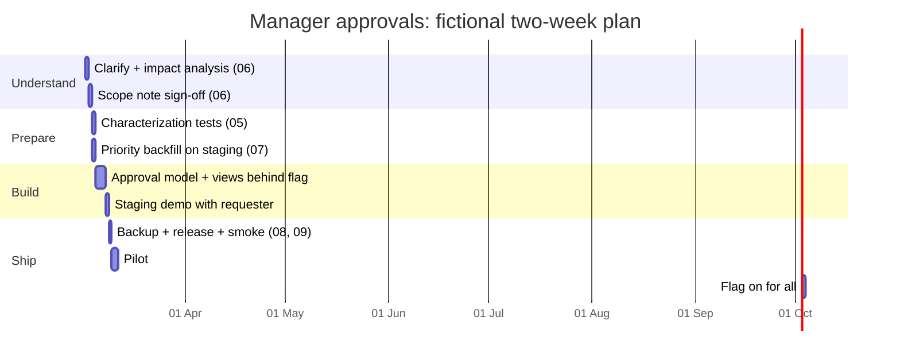
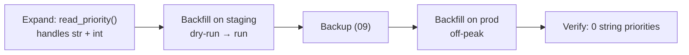

# 11 · Case study: one enhancement, end to end

> A fictional walk-through that ties docs 01–10 together. Acme Field Services, its people and its data are invented.
>
> See the [business workflow diagram](../assets/business-workflow.svg) for the finished flow this enhancement produces.

## The request

> "Can managers approve high-priority jobs before they're dispatched? Last month two urgent jobs went out to the wrong technician."
> (Operations lead, Acme Field Services)

## Timeline at a glance



## 1 · Clarify (doc 06)

| Question | Answer |
|----------|--------|
| Who uses it? | Four managers, a few times a day |
| Problem? | Priority-1 jobs dispatched without review |
| Today's fallback? | Phone call before dispatch |
| Success looks like? | No priority-1 job reaches "dispatched" without an approval record |
| Deadline driver? | Start of next quarter |

## 2 · Impact analysis (docs 02, 03)

The route table showed three views touching dispatch. The data-layer map showed **two** write paths into `work_orders`: the Django view and an older bulk-import command. The schema probe flagged `priority` as mixed `int`/`str`.

That second finding mattered: `priority == 1` would miss documents holding `"1"`. Without the probe, the approval check would have silently skipped some urgent jobs, which is the exact problem the feature was meant to solve.

## 3 · Scope note

- **In:** request-approval button, manager approvals list, dispatch blocked until approved (flagged).
- **Out:** notifications, mobile push, reporting (phase 2).
- **Data:** backfill `priority` to int first; add `approval` sub-document lazily.
- **Rollback:** flag `approvals_v1` off.

Signed off by the requester by email.

## 4 · Safety nets (doc 05)

- Characterization tests for the order list and dispatch view, with seed data including a string `"1"` priority.
- The bulk-import command got its first test, because it's the second write path.

## 5 · Data change (doc 07)

The priority backfill ran on staging (`--dry-run`, then real). A handful of unconvertible values were parked in `priority_legacy` and reviewed with the requester. Production ran off-peak after a fresh backup.



## 6 · Build behind a flag

```python
def can_dispatch(order: dict, user) -> tuple[bool, str | None]:
    if not is_enabled("approvals_v1", user):
        return True, None                                  # today's behaviour
    if read_priority(order) != 1:
        return True, None
    state = order.get("approval", {}).get("state", "pending")
    if state == "approved":
        return True, None
    return False, "Manager approval required before dispatch."
```

```python
import pytest

@pytest.mark.parametrize("flag_on,priority,state,expected", [
    (False, 1,   None,       True),    # flag off: unchanged
    (True,  1,   None,       False),   # needs approval
    (True,  "1", None,       False),   # legacy string still caught
    (True,  1,   "approved", True),
    (True,  2,   None,       True),    # only priority 1 is gated
])
def test_can_dispatch(flag_on, priority, state, expected, monkeypatch):
    monkeypatch.setattr("acme.orders.rules.is_enabled", lambda *_: flag_on)
    order = {"priority": priority, **({"approval": {"state": state}} if state else {})}
    assert can_dispatch(order, user=None)[0] is expected
```

## 7 · Release (docs 08, 09)

`release.ps1` ran checks, collected static files, took a pre-release backup, switched the junction and ran the smoke script. The flag stayed off, so users saw no change.

## 8 · Pilot, then everyone (doc 10)

Two managers piloted for two days. One S3 came up (the approvals list didn't sort by age) and was logged in the known-issues log and fixed. Then the flag was switched on for everyone. The flag's removal was scheduled for three weeks later.

## What made it safe

| Risk | What caught it |
|------|----------------|
| Mixed `priority` types would bypass the check | Schema probe (03) + seed data (05) |
| Bulk import could create unapproved orders | Two-write-path finding (02, 03) |
| Release breaks dispatch for everyone | Flag off at release; characterization tests |
| Backfill damages data | Idempotent script, staging first, fresh backup (07, 09) |
| "That's not what I asked for" | Written scope + staging demo (06) |

## Checklist: the whole playbook on one page

- [ ] Inventory, app guide, risk list (01)
- [ ] Route table and flow diagrams (02)
- [ ] Schema probe and data-layer map (03)
- [ ] Local + staging with scrubbed data (04)
- [ ] Characterization tests + smoke script (05)
- [ ] Scope note signed off; change behind a flag (06)
- [ ] Expand → migrate → contract for data (07)
- [ ] Release folders, scripted release, one-step rollback (08)
- [ ] Verified backups and timed restore drills (09)
- [ ] Severity rules, logs, alerts, known-issues log (10)
